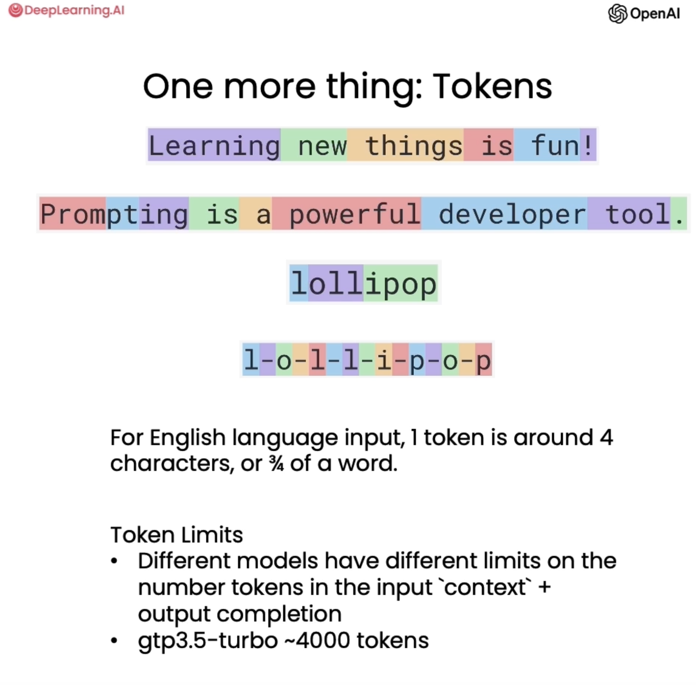

# ChatGPT


## Prompt Engineering

> [🔗DeepLearning.AI Course: ChatGPT Prompt Engineering for Developers](https://learn.deeplearning.ai/ChatGPT-prompt-eng)

### Two Types of large language models(LLMs)


=== "Base LLM"

    > Predicts next word, based on text training data

    !!! example

        **Once upon a time, there was a unicorn**  
        that lived in a magical forest with all her unicorn friends.

        **What is the capital of France?**  
        What is France's largest city?  
        What is France's population?  
        What is the currency of France?

=== "Instruction Tuned LLM"

    > Tries to follow instructions.  
    > Fine-tune on instructions and good attempts at following those instructions.

    !!! example

        What is the capital of France?  
        The capital of France is Paris.

<hr/>

Getting from a Base LLM to an instruction tuned LLM:

1. Train a Base LLM on a lot of data
2. Further train the model:
   * Fine-tune on examples of where the output follows an input instruction
   * Obtain human-ratings of the quality of different LLM outputs, on criteria such as whether it is helpful, honest, and harmless
   * Tune LLM to increase probability that it generates the more highly rated outputs using RLHF

!!! tip

    > RLHF: Reinforcement Learning from Human Feedback

### Setup

```python
import os

import openai
from dotenv import load_dotenv, find_dotenv

load_dotenv(find_dotenv())
openai.api_key = os.getenv('OPENAI_API_KEY')

def get_completion(prompt, model="gpt-3.5-turbo"):
    messages = [{"role": "user", "content": prompt}]
    response = openai.ChatCompletion.create(
        model=model,
        messages=messages,
        temperature=0, # this is the degree of randomness of the model's output
    )
    return response.choices[0].message["content"]
```

### Guidelines for Prompting

#### Principle 1: Write clear and specific instructions

* Tactic 1: Use delimiters to clearly indicate distinct parts of the input
    * Triple quotes: `"""` or `'''`
    * Triple backticks: `` ``` ``
    * Triple dashes: `---`
    * Angle brackets: `< >`
    * XML tags: `<tag> </tag>`

!!! example

    ```
    Summarize the text delimited by triple backticks \ 
    into a single sentence.
    ```{text}```
    ```

* Tactic 2: Ask for structured output like HTML, JSON

!!! example

    ```
    Generate a list of three made-up book titles along with their authors and genres. 
    Provide them in JSON format with the following keys: 
    book_id, title, author, genre.
    ```

* Tactic 3:
    * Ask the model to check whether conditions are satisfied
    * Check assumptions required to do the task

!!! example

    ```
    You will be provided with text delimited by triple quotes. 
    If it contains a sequence of instructions,
    re-write those instructions in the following format:

    Step 1 - ...
    Step 2 - …
    …
    Step N - …

    If the text does not contain a sequence of instructions,
    then simply write "No steps provided."

    """{text}"""
    ```

* Tactic 4:
    * "Few-shot" prompting
    * Give successful examples of completing tasks then ask model to perform the task

!!! example

    ```
    Your task is to answer in a consistent style.

    <child>: Teach me about patience.

    <grandparent>: The river that carves the deepest valley flows from a modest spring
    the grandest symphony originates from a single note;
    the most intricate tapestry begins with a solitary thread.

    <child>: Teach me about resilience.
    ```

#### Principle 2: Give the model time to "think"

* Tactic 1: Specify the steps to complete a task
    * Step 1: ...
    * Step 2: ...
    * Step 3: ...
    * ...
    * Step N: ...

!!! example

    ```
    Perform the following actions: 
    1 - Summarize the following text delimited by triple backticks with 1 sentence.
    2 - Translate the summary into French.
    3 - List each name in the French summary.
    4 - Output a json object that contains the following keys: french_summary, num_names.

    Separate your answers with line breaks.

    Text:
    ```{text}```
    ```

* Tactic 2: Instruct the model to work out its solution before rushing to a conclusion

#### Model Limitations

> Hallucination: Makes statements that sound plausible but are not true

Reducing hallucinations:
First find relevant information, then answer the question based on that information.

### Iterative Prompting

Iterative Process:

* Try something
* Analyze where the result does not give what you want
* Clarify instructions give more time to think
* Refine prompts with a batch of examples

### Summarizing

```python
prod_review = """
Got this panda plush toy for my daughter's birthday, \
who loves it and takes it everywhere. It's soft and \ 
super cute, and its face has a friendly look. It's \ 
a bit small for what I paid though. I think there \ 
might be other options that are bigger for the \ 
same price. It arrived a day earlier than expected, \ 
so I got to play with it myself before I gave it \ 
to her.
"""
```

#### Summarize with a word/sentence/character limit

!!! example

    ```
    Your task is to generate a short summary of a product review from an ecommerce site. 

    Summarize the review below, delimited by triple backticks, in at most 30 words. 

    Review: ```{prod_review}```
    ```

#### Summarize with a focus on shipping and delivery

!!! example

    ```
    Your task is to generate a short summary of a product review from an ecommerce site to
    give feedback to the Shipping deparmtment. 

    Summarize the review below, delimited by triple backticks, in at most 30 words,
    and focusing on any aspects that mention shipping and delivery of the product. 

    Review: ```{prod_review}```
    ```

#### Try "extract" instead of "summarize"

!!! example

    ```
    Your task is to extract relevant information from a product review from an ecommerce site
    to give feedback to the Shipping department. 

    From the review below, delimited by triple quotes extract the information relevant to shipping and delivery.
    Limit to 30 words. 

    Review: ```{prod_review}```
    ```

### Inferring

```python
lamp_review = """
Needed a nice lamp for my bedroom, and this one had \
additional storage and not too high of a price point. \
Got it fast.  The string to our lamp broke during the \
transit and the company happily sent over a new one. \
Came within a few days as well. It was easy to put \
together.  I had a missing part, so I contacted their \
support and they very quickly got me the missing piece! \
Lumina seems to me to be a great company that cares \
about their customers and products!!
"""
```

#### Sentiment (positive/negative)

!!! example

    ```
    What is the sentiment of the following product review, 
    which is delimited with triple backticks?

    Review text: '''{lamp_review}'''
    ```

!!! example

    ```
    What is the sentiment of the following product review, 
    which is delimited with triple backticks?

    Give your answer as a single word, either "positive" or "negative".

    Review text: '''{lamp_review}'''
    ```

#### Identify types of emotions

!!! example

    ```
    Identify a list of emotions that the writer of the following review is expressing.
    Include no more than five items in the list.
    Format your answer as a list of lower-case words separated by commas.

    Review text: '''{lamp_review}'''
    ```

#### Identify anger

!!! example

    ```
    Is the writer of the following review expressing anger?
    The review is delimited with triple backticks.
    Give your answer as either yes or no.

    Review text: '''{lamp_review}'''
    ```

#### Extract product and company name from customer reviews

!!! example

    ```
    Identify the following items from the review text: 
    - Item purchased by reviewer
    - Company that made the item

    The review is delimited with triple backticks.
    Format your response as a JSON object with "Item" and "Brand" as the keys. 
    If the information isn't present, use "unknown" as the value.
    Make your response as short as possible.
      
    Review text: '''{lamp_review}'''
    ```

#### Doing multiple tasks at once

!!! example

    ```
    Identify the following items from the review text: 
    - Sentiment (positive or negative)
    - Is the reviewer expressing anger? (true or false)
    - Item purchased by reviewer
    - Company that made the item

    The review is delimited with triple backticks.
    Format your response as a JSON object with "Sentiment", "Anger", "Item" and "Brand" as the keys.
    If the information isn't present, use "unknown" as the value.
    Make your response as short as possible.
    Format the Anger value as a boolean.

    Review text: '''{lamp_review}'''
    ```

### Transforming

#### Translation

!!! example

    ```
    Translate the following English text to Spanish:
    ```Hi, I would like to order a blender```

    Tell me which language this is: 
    ```Combien coûte le lampadaire?```

    Translate the following  text to French and Spanish and English pirate:
    ```I want to order a basketball```

    Translate the following text to Spanish in both the formal and informal forms: 
    'Would you like to order a pillow?'
    ```

#### Tone Transformation

!!! example

    ```
    Translate the following from slang to a business letter: 
    'Dude, This is Joe, check out this spec on this standing lamp.'
    ```

#### Format Conversion

!!! example

    ```
    Translate the following python dictionary from JSON to an HTML table with column headers and title:

    { "resturant employees" :[ 
        {"name":"Shyam", "email":"shyamjaiswal@gmail.com"},
        {"name":"Bob", "email":"bob32@gmail.com"},
        {"name":"Jai", "email":"jai87@gmail.com"}
    ]}
    ```

#### Spellcheck/Grammar check

> To signal to the LLM that you want it to proofread your text, you instruct the model to 'proofread' or 'proofread and correct'.

!!! example

    ```
    Proofread and correct the following text and rewrite the corrected version.
    If you don't find and errors, just say "No errors found".
    Don't use any punctuation around the text:
    ```{text}```
    ```

### Expanding

> Temperature is a hyperparameter used in some natural language processing models, including ChatGPT, to control ==the level of randomness or "creativity"== in the generated text.  
> Higher temperatures result in more diverse and unpredictable output.  
> Conversely, lower temperatures result in more conservative and predictable output.

!!! example

    ```python
    prompt = f"""
    You are a customer service AI assistant.
    Your task is to send an email reply to a valued customer.
    Given the customer email delimited by ```, \
    Generate a reply to thank the customer for their review.
    If the sentiment is positive or neutral, thank them for \
    their review.
    If the sentiment is negative, apologize and suggest that \
    they can reach out to customer service. 
    Make sure to use specific details from the review.
    Write in a concise and professional tone.
    Sign the email as `AI customer agent`.
    Customer review: ```{review}```
    Review sentiment: {sentiment}
    """
    response = get_completion(prompt, temperature=0.7)
    print(response)
    ```

## ChatGPT API

> [🔗DeepLearning.AI Course: Building Systems with the ChatGPT API](https://learn.deeplearning.ai/chatgpt-building-system)

### Tokens



!!! tip

    [ChatGPTのトークンとは？トークン数を調べる方法も解説！](https://bocek.co.jp/media/exercise/chatgpt/3465/)

### Role


### Setup

```python
import os

import openai
from dotenv import load_dotenv, find_dotenv

load_dotenv(find_dotenv())
openai.api_key = os.getenv('OPENAI_API_KEY')

def get_completion_from_messages(
    messages, 
    model="gpt-3.5-turbo", 
    temperature=0, 
    max_tokens=500
):
    response = openai.ChatCompletion.create(
        model=model,
        messages=messages,
        temperature=temperature, # this is the degree of randomness of the model's output
        max_tokens=max_tokens, # the maximum number of tokens the model can ouptut 
    )

    return response.choices[0].message["content"]

def get_completion_and_token_count(
    messages, 
    model="gpt-3.5-turbo", 
    temperature=0, 
    max_tokens=500
):
    response = openai.ChatCompletion.create(
        model=model,
        messages=messages,
        temperature=temperature, 
        max_tokens=max_tokens,
    )

    content = response.choices[0].message["content"]

    token_dict = {
        'prompt_tokens': response['usage']['prompt_tokens'],
        'completion_tokens': response['usage']['completion_tokens'],
        'total_tokens': response['usage']['total_tokens'],
    }

    return content, token_dict
```

### Moderation

[🔗Moderation API Docs](https://platform.openai.com/docs/guides/moderation/overview)


!!! example

```python
response = openai.Moderation.create(
    input="""
Here's the plan.  We get the warhead, 
and we hold the world ransom...
...FOR ONE MILLION DOLLARS!
"""
)
moderation_output = response["results"][0]
print(moderation_output)

# Output:
{
  "categories": {
    "hate": false,
    "hate/threatening": false,
    "self-harm": false,
    "sexual": false,
    "sexual/minors": false,
    "violence": false,
    "violence/graphic": false
  },
  "category_scores": {
    "hate": 2.9083385e-06,
    "hate/threatening": 2.8870053e-07,
    "self-harm": 2.9152812e-07,
    "sexual": 2.1934844e-05,
    "sexual/minors": 2.4384206e-05,
    "violence": 0.098616496,
    "violence/graphic": 5.059437e-05
  },
  "flagged": false
}
```

### Chaining Prompts

* Reduce number of tokens used in a prompt
* Skip some chains of the workflow when not needed for the task
* Easier to test - Include human-in-the-loop testing
* For complex tasks, keep track of state external to LLM(in your own code)
* Use external tools(web search, databases, etc.) to generate prompts
* More focused - Break down a complex task into smaller tasks
* Context Limitations - Max tokens for input prompt and output response
* Reduced Costs - Pay per token

### Evaluation


