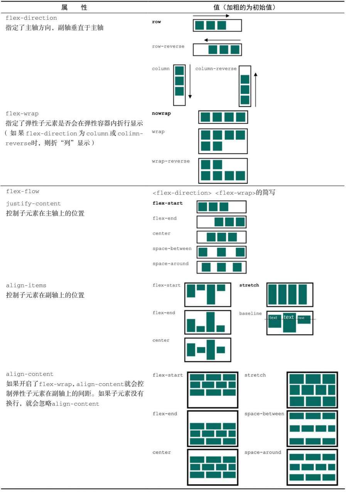
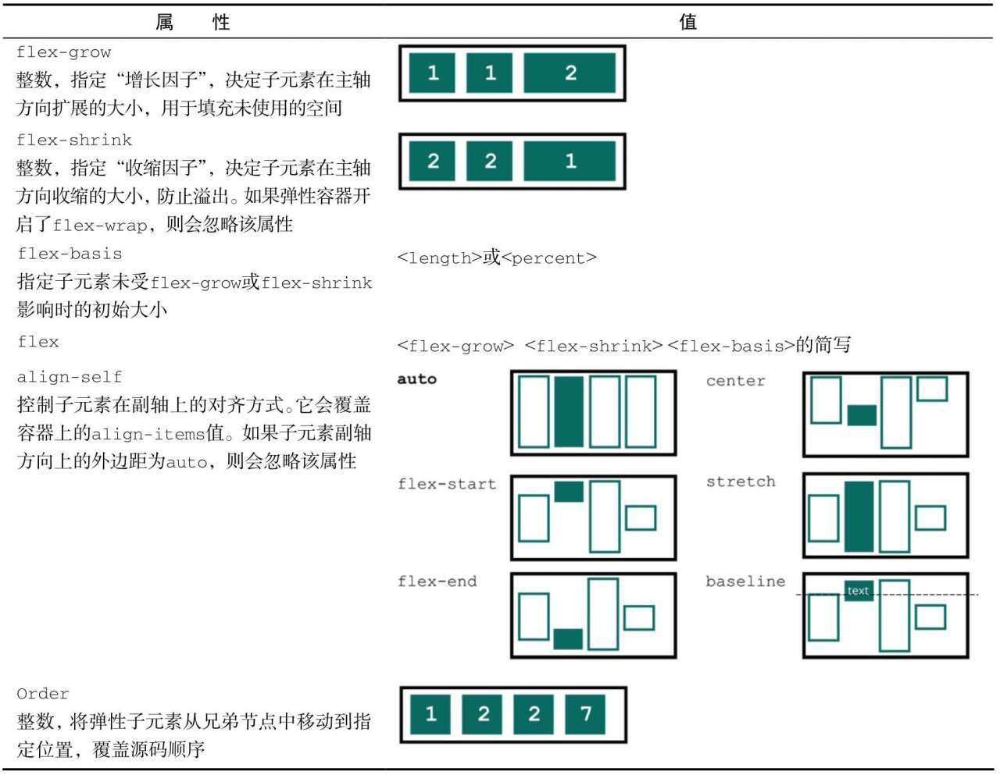

# CSS World

## 参考文档

[CSS 基础拾遗（核心知识、常见需求）](read://https_mp.weixin.qq.com/?url=https%3A%2F%2Fmp.weixin.qq.com%2Fs%2FdD49a3RV_uYXoMk3fSHrRg)

## @规则

CSS 里包含了以下 @规则：

- @namespace 告诉 CSS 引擎必须考虑XML命名空间。
- @media, 如果满足媒体查询的条件则条件规则组里的规则生效。
- @page, 描述打印文档时布局的变化.
- @font-face, 描述将下载的外部的字体。
- @keyframes, 描述 CSS 动画的关键帧。
- @document, 如果文档样式表满足给定条件则条件规则组里的规则生效。(推延至 CSS Level 4 规范)

不常用:

- @charset用于定义样式表使用的字符集。它必须是样式表中的第一个元素。如果有多个 `@charset` 被声明，只有第一个会被使用，而且不能在HTML元素或HTML页面的 `<style>` 元素内使用。
- @import用于告诉 CSS 引擎引入一个外部样式表。
- @supports 用于查询特定的 CSS 是否生效，可以结合 not、and 和 or 操作符进行后续的操作。

## 选择器

### 基本选择器

|        选择器        |    类型    |
| :------------------: | :--------: |
|          *           | 通配选择器 |
|          E           | 元素选择器 |
|         #ID          |  ID选择器  |
|        .class        |  类选择器  |
| selector1, selectorN | 群组选择器 |

### 层次选择器

| 选择器 |      类型      |
| :----: | :------------: |
|  E F   |   后代选择器   |
|  E>F   |    子选择器    |
|  E+F   | 相邻兄弟选择器 |
|  E~F   | 通用兄弟选择器 |

### 伪类选择器

#### 动态伪类选择器

|  选择器   |   功能   |
| :-------: | :------: |
|  E:link   | 未被访问 |
| E:visited | 已被访问 |
|  E:hover  |   停留   |
| E:active  |  被激活  |
|  E:focus  | 获得焦点 |

> “爱恨原则” LoVe/HAte
> Link-visited-hover-active

#### 目标伪类选择器

|  选择器  |                  功能描述                   |
| :------: | :-----------------------------------------: |
| E:target | 选择匹配E的所有元素,且匹配元素被相关URL指向 |

#### 语言伪类选择器

:lang E(language)表示选择匹配E的所有元素，且匹配元素指定了lang属性，而且其值为language。

#### UI元素状态伪类选择器

|   选择器   |   类型   |
| :--------: | :------: |
| E:checked  | 选中状态 |
| E:enabled  | 启用状态 |
| E:disabled | 禁用状态 |

#### 结构伪类选择器

- E:first-child
- E:last-child
- E:root
- E F:nth-child(n)
- E F:nth-last-child(n)
- E:nth-of-type(n)
- E:nth-last-of-type(n)
- E:first-of-type
- E:last-of-type
- E:only-child
- E:empty

> n可以是整数,关键字(even,odd),公式(2n+1)等
> n的起始值为1,当n为0时将选择不到任何元素
> “:empty”用来选择没有任何内容的元素，这里“没有任何内容”指的是一点内容都没有，哪怕是一个空格。

#### 否定伪类选择器

|  选择器  |         功能描述         |
| :------: | :----------------------: |
| E:not(F) | 匹配所有除元素F外的E元素 |

### 伪元素选择器

> 双冒号与单冒号在CSS3中主要用来区分伪类和伪元素。

- ::first-letter
- ::first-line
- ::before
- ::after
- ::selection

### 属性选择器

|    选择器     |                         功能描述                         |
| :-----------: | :------------------------------------------------------: |
|    E[attr]    |               选择匹配具有属性attr的E元素                |
|  E[attr=val]  |              attr的属性值为val(区分大小写)               |
| E[attr\|=val] |    attr属性值是一个具有val或者以val-开始(不推荐使用)     |
| E[attr~=val]  | attr属性具有多个空格分隔的值,其中一个值为val(不推荐使用) |
| E[attr*=val]  |               attr属性中任意位置包含了val                |
| E[attr^=val]  |                    attr属性以val开头                     |
| E[attr$=val]  |                    attr属性以val结尾                     |

> E省略时表示任意类型元素

## 层叠, 优先级和继承

### 层叠

- 选择器和声明块一起组成了*规则集（ruleset）*
- `@规则(at-rules)`是指用“@”符号开头的语法。比如@import规则或者@media查询。
- 行内元素属于“带作用域的”声明，它会覆盖任何来自样式表或者`<style>`标签的样式。
- 伪类选择器（如：hover）和属性选择器（如[type="input"]）与一个类选择器的优先级相同。通用选择器（＊）和组合器（>、+、~）对优先级没有影响。
- 当给一些声明加上！important时，就会先比较来源，再使用常规的优先级规则。最终会让一切回到起点：一旦引入一个！important，就会带来更多的！important。
- 通常最好让优先级尽可能低，这样当需要覆盖一些样式时，才能有选择空间。
- 如果两个声明的来源和优先级相同，其中一个声明在样式表中出现较晚，或者位于页面较晚引入的样式表中，则该声明胜出。

### 继承

- 不是所有的属性都能被继承。默认情况下，只有特定的一些属性能被继承，通常是我们希望被继承的那些。
- 可以分为如下几类：
  - 字体相关：`font-family`、`font-style`、`font-size`、`font-weight` 等；
  - 文本相关：`text-align`、`text-indent`、`text-decoration`、`text-shadow`、`letter-spacing`、`word-spacing`、`white-space`、`line-height`、`color` 等；
  - 列表相关：`list-style`、`list-style-image`、`list-style-type`、`list-style-position` 等；
  - 其他属性：`visibility`、`cursor` 等；
- 对于其他默认不继承的属性也可以通过以下几个属性值来控制继承行为：

  - `inherit`：继承父元素对应属性的计算值；
  - `initial`：应用该属性的默认值，比如 color 的默认值是 `#000`；
  - `unset`：如果属性是默认可以继承的，则取 `inherit` 的效果，否则同 `initial`；
  - `revert`：效果等同于 `unset`，兼容性差。

### 特殊值

- 有两个特殊值可以赋给任意属性，用于控制层叠：`inherit`和`initial`。
- 有时，你需要撤销作用于某个元素的样式。这可以用initial关键字来实现。
- initial重置为属性的初始值，而不是元素的初始值。

### 简写属性

- 大多数简写属性可以省略一些值，只指定我们关注的值。但是要知道，这样做仍然会设置省略的值，即它们会被隐式地设置为初始值。这会默默覆盖在其他地方定义的样式。
- 尤其对于较小的元素，左右的内边距最好大于上下内边距。这种样式很适合网页的按钮或者导航链接

## 相对单位

### 相对值的好处

- CSS为网页带来了后期绑定（late-binding）的样式：直到内容和样式都完成了，二者才会结合起来。
- 响应式——在CSS中指的是样式能够根据浏览器窗口的大小有不同的“响应”。
- 1in = 25.4mm = 2.54cm = 6pc = 72pt = 96px
- CSS像素并不严格等于显示器的像素，尤其在高清屏（视网膜屏）下。

### em和rem

- 1em等于当前元素的字号，其准确值取决于作用的元素
- 浏览器会根据相对单位的值计算出绝对值，称作*计算值（computed value）*。
- 对大多数浏览器来说，默认的字号为16px。准确地说，medium关键字的值是16px。
- em用在内边距、外边距以及元素大小上很好，但是用在字号上就会很复杂。
- 在文档中，根节点是所有其他元素的祖先节点。根节点有一个`伪类选择器（:root）`，可以用来选中它自己。这等价于类型选择器html，但是html的优先级相当于一个类名，而不是一个标签。
- rem是root em的缩写。rem不是相对于当前元素，而是相对于根元素的单位
- 拿不准的时候，用rem设置字号，用px设置边框，用em设置其他大部分属性

### 视口的相对单位

- 视口——浏览器窗口里网页可见部分的边框区域。它不包括浏览器的地址栏、工具栏、状态栏。
- ❑ vh：视口高度的1/100。❑ vw：视口宽度的1/100。❑ vmin：视口宽、高中较小的一方的1/100（IE9中叫vm，而不是vmin）。❑ vmax：视口宽、高中较大的一方的1/100（本书写作时IE和Edge均不支持vmax）
- 相对视口单位有一个不起眼的用途，就是设置字号
- 这样做的好处在于元素能够在这两种大小之间平滑地过渡，这意味着不会在某个断点突然改变。当视口大小改变时，元素会逐渐过渡。
- calc()函数内可以对两个及其以上的值进行基本运算

### 无单位的数值和行高

- 任何长度单位（如px、em、rem）都可以用无单位的值0，因为这些情况下单位不影响计算值，即0px、0%、0em均相等。
- 一个无单位的0只能用于长度值和百分比，比如内边距、边框和宽度等，而不能用于角度值，比如度，或者时间相关的值，比如秒。
- 当一个元素的值定义为长度（px、em、rem，等等）时，子元素会继承它的计算值。
- 使用无单位的数值时，继承的是声明值，即在每个继承子元素上会重新算它的计算值。

### 自定义属性（即CSS变量）

- 变量名前面必须有两个连字符（--），用来跟CSS属性区分，剩下的部分可以随意命名
- 变量必须在一个声明块内声明。
- 调用函数`var()`就能使用该变量
- `var()`函数接受第二个参数，它指定了备用值。如果第一个参数指定的变量未定义，那么就会使用第二个值。
- 如果`var()`函数算出来的是一个非法值，对应的属性就会设置为其初始值。
- 自定义属性的声明能够层叠和继承：可以在多个选择器中定义相同的变量，这个变量在网页的不同地方有不同的值。
- 自定义属性就像作用域变量一样，因为它的值会被后代元素继承。

## 盒模型

### 元素宽度的问题

- 当给一个元素设置宽或高的时候，指定的是内容的宽或高，所有内边距、边框、外边距都是追加到该宽度上的。
- 魔术数值（magic number）
- 在CSS中可以使用box-sizing属性调整盒模型的行为。

```css
:root {
    box-sizing: border-box;
}

*,
::before,
::after {
    box-sizing: inherit;
}
```

- box-sizing的默认值为content-box，这意味任何指定的宽或高都只会设置内容盒子的大小。将box-sizing设置为border-box后，height和width属性会设置内容、内边距以及边框的大小总和
- 盒模型通常不会被继承，但是使用inherit关键字可以强制继承。

### 元素高度的问题

- 普通文档流是为限定的宽度和无限的高度设计的。
- 普通文档流——指的是网页元素的默认布局行为。行内元素跟随文字的方向从左到右排列，当到达容器边缘时会换行。块级元素会占据完整的一行，前后都有换行。
- 用overflow属性可以控制溢出内容的行为
- overflow值分别是visible、hidden、scroll、auto
- 可以用overflow-x属性单独控制水平方向的溢出，或者用overflow-y控制垂直方向溢出。
- 要想让百分比高度生效，必须给父元素明确定义一个高度。
- 给容器设置display: table，给每一列设置display:table-cell。
- 不像block的元素，默认情况下，显示为table的元素宽度不会扩展到100%，因此需要明确指定宽度
- 外边距并不会作用于table-cell元素
- 可以用表格元素的border-spacing属性来定义单元格的间距。该属性接受两个长度值：水平间距和垂直间距
- 正的外边距会将容器的边缘往里推，而负的外边距则会将边缘往外拉
- 给容器设置display: flex，它就变成了一个弹性容器（flex container），子元素默认等高。
- 除非别无选择，否则不要明确设置元素的高度。先寻找一个替代方案。设置高度一定会导致更复杂的情况。
- min-height和max-height。你可以用这两个属性指定最小或最大值，而不是明确定义高度，这样元素就可以在这些界限内自动决定高度。
- vertical-align声明只会影响行内元素或者table-cell元素。对于行内元素，它控制着该元素跟同一行内其他元素之间的对齐关系。
- CSS中最简单的垂直居中方法是给容器相等的上下内边距
- [howtocenterincss网站](http://howtocenterincss.com/)

### 负外边距

- 左边或顶部的负外边距将元素向左或者向上拉
- 右边或底部的负外边距将跟随其后的元素向左或向上拉(导致重叠)

### 容器内的元素间距

- 迟钝的猫头鹰选择器（lobotomized owl selector）（以下简称猫头鹰选择器），因为它长这样：`＊ + ＊`
- 它会选中页面上有着相同父级的非第一个子元素

## 浮动

### 浮动的设计初衷

- 浮动能将一个元素（通常是一张图片）拉到其容器的一侧，这样文档流就能够包围它。这种布局在报纸和杂志中很常见，因此CSS增加了浮动来实现这种效果
- *浮动元素会被移出正常文档流，并被拉到容器边缘*。文档流会重新排列，但是它会包围浮动元素此刻所占据的空间。如果让多个元素向同侧浮动，它们就会挨着排列
- 通过将内容放置到两个嵌套的容器中，然后给内层的容器设置外边距，让它在外层容器中居中 -> 双容器模式(double container pattern)
- 要实现将图片移动到网页一侧，并且让文字围绕图片的效果，浮动仍然是唯一的方法。

### 容器折叠和清除浮动

- 浮动元素不同于普通文档流的元素，它们的高度不会加到父元素上
- 将一个元素放在主容器的末尾，并对它使用clear，这会让容器扩展到浮动元素下面

### 出乎意料的“浮动陷阱”

- 浏览器会将浮动元素尽可能地放在靠上的地方

## Flexbox

- Flexbox，全称弹性盒子布局（Flexible Box Layout）

### Flexbox的原则

- 给元素添加display: flex，该元素变成了一个*弹性容器（flex container）*，它的*直接子元素*变成了*弹性子元素（flexitem）*。
- 弹性子元素默认是在同一行按照从左到右的顺序并排排列。弹性容器像块元素一样填满可用宽度，但是弹性子元素不一定填满其弹性容器的宽度。
- 弹性子元素高度相等，该高度由它们的内容决定。
- Flexbox允许使用`margin: auto`来填充弹性子元素之间的可用空间。

### 弹性子元素的大小

- flex属性控制弹性子元素在主轴方向上的大小
- flex属性是三个不同大小属性的简写：`flex-grow`、`flex-shrink`和`flex-basis`。
- flex-basis定义了元素大小的基准值，即一个初始的“主尺寸”。
- 多出来的留白（或剩余宽度）会按照flex-grow（增长因子）的值分配给每个弹性子元素，flex-grow的值为非负整数。
- flex-grow的值越大，元素的“权重”越高，也就会占据更大的剩余宽度。

### 对齐、间距等细节

弹性容器的属性:

弹性子元素的属性:


- justify-content控制子元素在主轴方向的对齐方式，align-items则控制子元素在副轴方向的对齐方式。align-items的初始值为stretch，在水平排列的情况下让所有子元素填充容器的高度，在垂直排列的情况下让子元素填充容器的宽度，因此它能实现等高列。
- 如果开启了换行（用flex-wrap）, align-content属性就可以控制弹性容器内沿副轴方向每行之间的间距。

## 网格布局

### 网页布局开启新纪元

- 跟Flexbox类似，网格布局也是作用于两级的DOM结构。
- 设置为`display: grid`的元素成为一个*网格容器（grid container）*。它的子元素则变成*网格元素（grid items）*。
- 分数单位（fraction unit） -> `fr`

### 网格剖析

- 网格的组成部分:
  - 网格线(grid line)
  - 网格轨道(grid track)
  - 网格单元(grid cell)
  - 网格区域(grid area)
- `repeat()`
- 如果想要一个网格元素在垂直方向上跨越1号网格线到3号网格线，就需要给元素设置`grid-column: 1 / 3`。或者设置`grid-row: 3 / 5`让元素在水平方向上跨越3号网格线到5号网格线。这两个属性一起就能指定一个元素应该放置的网格区域。
- Flexbox在一个方向上对齐元素，而网格在两个方向上对齐元素
- Flexbox以内容为切入点由内向外工作，而网格以布局为切入点由外向内工作

### 替代语法

- 网格布局共设计了三种语法：编号的网格线、命名的网格线、命名的网格区域。

### 显式和隐式网格

- `minmax()`函数。它指定两个值：最小尺寸和最大尺寸。浏览器会确保网格轨道的大小介于这两者之间。
- repeat()函数里的auto-fill关键字是一个特殊值。设置了之后，只要网格放得下，浏览器就会尽可能多地生成轨道，并且不会跟指定大小（minmax()值）的限制产生冲突。
- 加上紧凑的auto-flow选项dense，小网格元素会填满大的元素造成的空白区域。
- 子网格（subgrid）

### 特性查询

- @supports规则后面跟着一个小括号包围的声明。如果浏览器理解这个声明（在本例中，浏览器支持网格），它就会使用大括号里面的所有样式规则。如果它不理解小括号里的声明，就不会使用这些样式规则。

### 对齐

- CSS给网格布局提供了三个调整属性：justify-content、justify-items、justify-self
- 还有三个对齐属性：align-content、align-items、align-self
- 网格内的对齐属性
